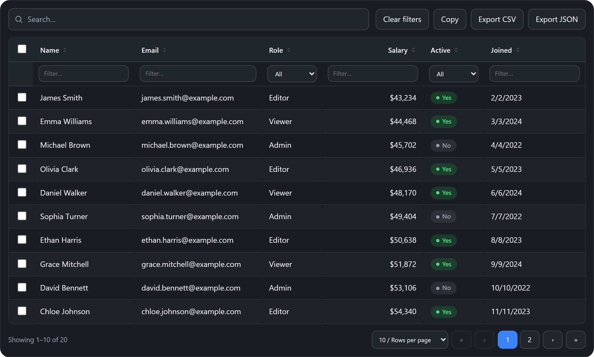

<p align="center">
  
</p>

<h1 align="center">Neiki's Table</h1>

<p align="center">
  
  
  
  
  <br>
  
  
</p>

<p align="center">
  <b>Lightweight, CDN-ready Data Table Web Component</b><br>
  <i>Zero dependencies, framework-independent, drop into any page.</i>
</p>

<p align="center">
  
  
  
  
</p>

<p align="center">
  ⭐ Enjoying Neiki's Table? Give it a Star and Fork the repository! ❤️<br>
  Your support helps me see that the project is useful to developers<br>
  and motivates me to keep improving it with more frequent updates.
</p>

<p align="center">
  <a href="https://github.com/neikiri/neiki-table/fork">
    
  </a>
</p>

---

<p align="center">
  
</p>

---

**Live version:** [https://neikiri.dev/table](https://neikiri.dev/table)

---

## 🧭 Overview

Neiki's Table is a Web Component written in plain JavaScript with **zero dependencies**. Drop a single `<neiki-table>` tag onto a page and get an accessible, responsive, themeable data table — sorting, search, per-column filters, pagination, inline editing, row selection and CSV/JSON export — with no framework, bundler, or build step required.

```html
<script src="https://cdn.neikiri.dev/neiki-table/neiki-table.min.js"></script>

<neiki-table id="users"></neiki-table>

<script>
  const table = document.querySelector('#users');
  table.setColumns([
    { key: 'name', label: 'Name' },
    { key: 'email', label: 'Email' }
  ]);
  table.setData([
    { id: 1, name: 'Alice Johnson', email: 'alice@example.com' },
    { id: 2, name: 'John Smith', email: 'john@example.com' }
  ]);
</script>
```

That snippet is a complete, working data table with sorting, search, filters, pagination, inline editing, row selection and export already enabled.

---

## ✨ Why Neiki's Table?

- **One script, no dependencies.** The component ships as a single custom element. No React, Vue, Svelte, or Angular required — it works in plain HTML just as well as inside any framework.
- **CDN-ready.** Load it from jsDelivr or unpkg and start using `<neiki-table>` immediately.
- **Full-featured out of the box.** Sorting, debounced global search, per-column filters, numbered pagination, inline cell editing, row selection, column resizing, density modes, custom cell formatting, and CSV/JSON export plus copy-to-clipboard — all enabled by default, all individually toggleable.
- **Internationalized.** Ships with English, Czech, German, Spanish, French, Italian, Polish and Slovak translations. Switch locale live, or register your own with `addTranslations()`.
- **Accessible by design.** Semantic table markup, sortable headers exposed as buttons with `aria-sort`, labeled checkboxes, visible focus states, and keyboard support for sorting and editing.
- **Safe with multiple instances.** Load the script more than once, or use several tables on one page — the custom element registers itself once.
- **Secure by default.** Cell values are rendered as text (never `innerHTML`), and CSV export neutralizes formula-injection payloads (`=`, `+`, `-`, `@`) before writing the file.

---

## 🚀 Getting started

The recommended install is the single bundled script from the CDN.

```html
<script src="https://cdn.neikiri.dev/neiki-table/neiki-table.min.js"></script>
```

<details>
<summary><b>Other installation options</b> (pinned version, jsDelivr, unpkg, npm, self-hosted)</summary>
<br>

**Pin a specific version (recommended for production)**

```html
<script src="https://cdn.neikiri.dev/neiki-table/1.0.0/neiki-table.min.js"></script>
```

**Load CSS and JS separately**

```html
<!-- Latest -->
<link rel="stylesheet" href="https://cdn.neikiri.dev/neiki-table/neiki-table.css">
<script src="https://cdn.neikiri.dev/neiki-table/neiki-table.js"></script>

<!-- Or pinned -->
<link rel="stylesheet" href="https://cdn.neikiri.dev/neiki-table/1.0.0/neiki-table.css">
<script src="https://cdn.neikiri.dev/neiki-table/1.0.0/neiki-table.js"></script>
```

**Alternative CDN — jsDelivr**

```html
<script src="https://cdn.jsdelivr.net/npm/neiki-table@latest/dist/neiki-table.min.js"></script>
<!-- Pinned -->
<script src="https://cdn.jsdelivr.net/npm/neiki-table@1.0.0/dist/neiki-table.min.js"></script>
```

**Alternative CDN — unpkg**

```html
<script src="https://unpkg.com/neiki-table@1.0.0/dist/neiki-table.min.js"></script>
```

**Package manager**

```bash
npm install neiki-table
# or
yarn add neiki-table
# or
pnpm add neiki-table
```

**Self-hosted**

```html
<script src="path/to/dist/neiki-table.min.js"></script>
```

The built `dist/neiki-table.min.js` bundles its CSS inline — one file is all you need, no separate stylesheet to keep track of. `dist/neiki-table.css` and `.min.css` are also published for reference (e.g. to preview the default styles or diff a customization), but the component never fetches them at runtime.

</details>

---

## 🧩 Basic usage

```html
<neiki-table id="users" locale="en" theme="auto" row-key="id"></neiki-table>

<script>
  const table = document.querySelector('#users');

  table.setColumns([
    { key: 'name', label: 'Name', type: 'text' },
    { key: 'email', label: 'Email', type: 'text' },
    { key: 'role', label: 'Role', type: 'select', options: ['Admin', 'Editor', 'Viewer'] },
    { key: 'active', label: 'Active', type: 'boolean' },
    { key: 'joined', label: 'Joined', type: 'date' }
  ]);

  table.setData([
    { id: 1, name: 'Alice Johnson', email: 'alice@example.com', role: 'Admin', active: true, joined: '2023-02-14' },
    { id: 2, name: 'John Smith', email: 'john@example.com', role: 'Editor', active: true, joined: '2023-06-01' }
  ]);
</script>
```

Multiple instances can coexist on the same page, each with independent configuration and data.

---

## 📐 Columns

Columns are defined with `setColumns()` (or the `columns` attribute, as a JSON string, for quick static demos):

| Property | Type | Default | Description |
|----------|------|---------|--------------|
| `key` | string | — | Property name to read from each row object |
| `label` | string | `key` | Column header text |
| `type` | `text`, `number`, `boolean`, `date`, `select` | `text` | Controls formatting, sorting, filtering and the inline editor |
| `options` | array | — | For `type: 'select'` — an array of strings, or `{ value, label }` objects |
| `sortable` | boolean | `true` | Whether the column header can be clicked to sort |
| `filterable` | boolean | `true` | Whether the column gets a filter control in the filter row |
| `editable` | boolean | `true` | Whether cells in this column can be inline-edited (also gated by the table's `editable` config) |
| `resizable` | boolean | `true` | Whether the column can be resized by dragging its header edge (also gated by the table's `resizable` config) |
| `align` | `left`, `center`, `right` | `left` (`right` for `number`) | Horizontal text alignment for the column's cells and header |
| `format` | function | — | `(value, row) => string` — custom display text for the cell. Applies to what's rendered, searched, filtered and exported. Output is always inserted with `textContent`, so it can't inject markup |
| `width` | string | — | Initial CSS width for the column (e.g. `'120px'`) |

```javascript
table.setColumns([
  { key: 'name', label: 'Name' },
  { key: 'salary', label: 'Salary', type: 'number', align: 'right',
    format: (v) => v == null ? '' : '$' + Number(v).toLocaleString('en-US') }
]);
```

---

## 🗃️ Data

```javascript
table.setData(rows);       // replaces all rows (array of plain objects)
table.getData();           // full current dataset (deep-ish copy)
table.getSelectedRows();   // currently selected rows
```

Each row should have a stable identifier under the key configured by `row-key` (default `id`); it's used to track selection, editing, and sorting stability across re-renders.

---

## 🏷️ Attributes

| Attribute | Values | Default | Description |
|-----------|--------|---------|--------------|
| `locale` | `en`, `cs`, `de`, `es`, `fr`, `it`, `pl`, `sk`, or a custom locale registered via `addTranslations()` | `en` | UI language |
| `theme` | `light`, `dark`, `auto` | `auto` | Visual theme |
| `density` | `compact`, `normal`, `spacious` | `normal` | Vertical spacing / row height |
| `row-key` | string | `id` | Property used as each row's stable identifier |
| `searchable` | boolean attribute | on | Shows/enables the global search box |
| `filterable` | boolean attribute | on | Shows/enables the per-column filter row |
| `selectable` | boolean attribute | on | Shows/enables the row-selection checkbox column |
| `editable` | boolean attribute | on | Enables inline cell editing (per-column `editable: false` still overrides) |
| `resizable` | boolean attribute | on | Enables column resizing (per-column `resizable: false` still overrides) |
| `paginated` | boolean attribute | on | Shows/enables pagination controls |
| `exportable` | boolean attribute | on | Shows/enables the CSV/JSON export and copy buttons |
| `loading` | boolean attribute | off | Shows a loading overlay over the table body |
| `search-debounce` | number (ms) | `180` | Delay before a typed search query is applied (`0` = immediate) |
| `page-size` | number | `10` | Rows per page |
| `columns` | JSON string | — | Declarative alternative to `setColumns()` |
| `data` | JSON string | — | Declarative alternative to `setData()` |

---

## ⚙️ Methods

```javascript
const table = document.querySelector('neiki-table');

table.setColumns(columns);          // define columns, returns `table`
table.getColumns();                 // current column definitions
table.setData(rows);                // replace all data, returns `table`
table.getData();                    // current dataset

table.setConfig({ pageSize: 25 });  // merge partial config, returns `table`
table.getConfig();                  // full resolved config

table.setLocale('cs');              // switch UI language
table.getLocale();                  // current locale
table.addTranslations('uk', {...}); // register/extend a locale's dictionary

table.setDensity('compact');        // 'compact' | 'normal' | 'spacious'
table.setLoading(true);             // toggle the loading overlay

table.sortBy('name', 'asc');        // sort programmatically ('asc' | 'desc')
table.search('jan');                // set the global search query
table.setFilter('role', 'Admin');   // set a single column filter
table.clearFilters();               // clear search + all filters

table.goToPage(2);                  // navigate to a page (1-based)
table.setPageSize(50);              // change rows per page

table.selectRow(rowKey, true);      // select/deselect a single row
table.selectAll(true);              // select/deselect all currently filtered rows
table.clearSelection();
table.getSelectedRows();            // currently selected rows

table.exportCSV('filename.csv');    // download selection, or filtered view if none selected
table.exportJSON('filename.json');
table.copyCSV();                    // copy the same CSV to the clipboard

table.refresh();                    // force a re-render
```

---

## 📡 Events

All events bubble and are composed (cross Shadow DOM boundary), with details on `event.detail`.

| Event | Fired when | `detail` |
|-------|------------|----------|
| `neiki-table:ready` | The component finished its first render | `{ config }` |
| `neiki-table:sort` | The sort column/direction changes | `{ key, dir }` |
| `neiki-table:search` | The global search query changes | `{ query }` |
| `neiki-table:filter` | A column filter changes, or filters are cleared | `{ filters }` |
| `neiki-table:page-change` | The page or page size changes | `{ page, pageSize? }` |
| `neiki-table:select` | Row selection changes | `{ selected }` (array of row keys) |
| `neiki-table:cell-edit` | An inline edit is committed | `{ rowKey, key, oldValue, newValue, row }` |
| `neiki-table:row-click` | A row body is clicked (ignoring inline controls) | `{ rowKey, row }` |
| `neiki-table:column-resize` | A column is resized by dragging | `{ key, width }` |
| `neiki-table:export` | CSV/JSON export runs | `{ format, count }` |
| `neiki-table:copy` | Copy-to-clipboard runs | `{ format, count, ok }` |
| `neiki-table:error` | Invalid `columns`/`data` JSON attribute | `{ reason }` |

```javascript
table.addEventListener('neiki-table:cell-edit', (event) => {
  console.log(event.detail.key, event.detail.oldValue, '→', event.detail.newValue);
});
```

---

## 🎨 CSS variables

All variables use the `--ntbl-*` prefix and can be overridden per instance or globally:

```css
neiki-table {
  --ntbl-radius: 12px;
  --ntbl-accent: #7c3aed;
  --ntbl-bg: #ffffff;
  --ntbl-color: #1f2328;
}
```

| Variable | Purpose |
|----------|---------|
| `--ntbl-radius` | Outer container border radius |
| `--ntbl-font-size` | Base font size |
| `--ntbl-row-height` | Approximate row height |
| `--ntbl-shadow` | Outer container box-shadow |
| `--ntbl-bg` / `--ntbl-color` | Base background / text color |
| `--ntbl-muted` | Secondary text color (footer, empty state) |
| `--ntbl-border` | Border color used throughout |
| `--ntbl-header-bg` | Table header background |
| `--ntbl-row-hover` / `--ntbl-row-selected` | Row hover / selected background |
| `--ntbl-stripe` | Zebra-striping tint for even rows |
| `--ntbl-accent` / `--ntbl-focus-ring` | Accent and keyboard focus ring color |
| `--ntbl-input-bg` / `--ntbl-input-border` | Search/filter/edit input colors |
| `--ntbl-badge-true-bg` / `--ntbl-badge-true-color` | Boolean "yes" badge colors |
| `--ntbl-badge-false-bg` / `--ntbl-badge-false-color` | Boolean "no" badge colors |

---

## 🌗 Themes

| Theme | Description |
|-------|-------------|
| `light` | Light background, dark text |
| `dark` | Dark background, light text |
| `auto` | Follows `prefers-color-scheme`, updates live if the OS theme changes |

---

## 🌍 Internationalization

Built-in locales: `en`, `cs`, `de`, `es`, `fr`, `it`, `pl`, `sk`. Set the `locale` attribute/config, or switch at runtime with `setLocale()`. To add a language (or override strings in an existing one):

```javascript
table.addTranslations('uk', {
  searchPlaceholder: 'Пошук…',
  noResults: 'Відповідних рядків не знайдено',
  // ...see src/neiki-table.js for the full key list
});
table.setLocale('uk');
```

---

## ♿ Accessibility

- Sortable column headers are keyboard-focusable (`tabindex="0"`, `role="button"`) and expose `aria-sort`.
- Row and select-all checkboxes carry descriptive `aria-label`s.
- Editable cells are focusable and can be opened for editing with the keyboard (`Enter`), and committed/cancelled with `Enter`/`Escape`.
- Visible `:focus-visible` outlines on every interactive element.
- `prefers-reduced-motion: reduce` disables transitions.
- Colors default to sufficient contrast in both light and dark themes.

---

## 🔒 Security

- Cell content is always rendered with `textContent`, never `innerHTML` — row data can never inject markup into the page.
- CSV export neutralizes formula-injection payloads: values starting with `=`, `+`, `-`, `@`, tab, or carriage return are prefixed with a leading apostrophe before being written, so spreadsheet software won't execute them as formulas.
- CSV fields are quoted and escaped per RFC 4180 when they contain commas, quotes, or newlines.
- Export downloads use `Blob` + a temporary `<a download>` link — no navigation, no server round-trip, no user data leaves the page.

See [SECURITY.md](SECURITY.md) for the full policy and how to report vulnerabilities.

---

## 🎬 Demo

Open [`demo/index.html`](demo/index.html) in a browser (or serve the repo locally) to see sorting, search, filters, pagination, inline editing, row selection, export, locale switching, and theming in action.

---

## 🛠️ Build / minify

```bash
npm run build
```

Runs [`minify.py`](minify.py), which reads `src/neiki-table.js` and `src/neiki-table.css` and produces:

```
dist/neiki-table.js       # CSS embedded inline, unminified
dist/neiki-table.min.js   # CSS embedded inline, minified (recommended)
dist/neiki-table.css      # standalone copy, for reference
dist/neiki-table.min.css  # standalone copy, for reference
```

The CSS is baked directly into both JavaScript bundles at build time — loading either `dist` script is enough on its own, no separate stylesheet request required. JS minification uses [Terser](https://github.com/terser/terser) via `npx` when available, falling back to an unminified copy otherwise.

```bash
npm test
```

Runs `node --check` against the source file as a syntax sanity check.

---

## 🌐 Browser support

Neiki's Table uses Custom Elements v1, Shadow DOM, and standard DOM APIs, and targets current versions of modern browsers.

| Browser | Support |
|---------|---------|
| Chrome | Latest |
| Firefox | Latest |
| Safari | Latest |
| Edge | Latest |

> Internet Explorer is not supported.

---

## 🤝 Contributing

Contributions are welcome. Please review [CONTRIBUTING.md](CONTRIBUTING.md) and the [CODE_OF_CONDUCT.md](CODE_OF_CONDUCT.md) before opening an issue or pull request. Security-related reports should follow [SECURITY.md](SECURITY.md).

The component source lives in `src/` (`neiki-table.js`, `neiki-table.css`); the distributable builds are in `dist/`.

---

## 📄 License

Released under the **MIT License**. See the [LICENSE](LICENSE) file for details.

---

<p align="center">
  Made with ❤️ for the web community
</p>
